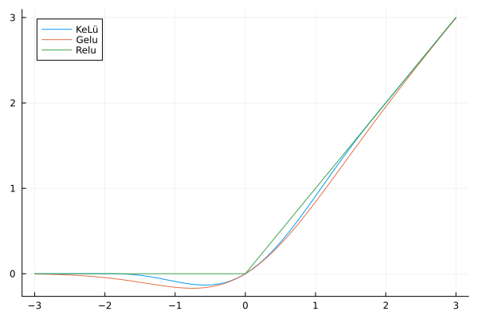

A brand new activation function: KeLü (Keen Learning Unit):

It has continuous derivative at 0, while its third derivative has singularities at -3.5 and 3.5. Furthermore, compared to GELU it decays zero a bit faster. Both Flux and Jax implementations are included. For comparison we implement three well known networks. 

Both Jax and Flux directories include implementation of the papers with respective abbreviations:

<li> Patches are all you need --- P</li>
<li> MobineNet v2 --- M2</li>
<li> ResNet50 --- R50 </li>
<li> GPT2 --- GPT2 </li>

All the above models are trained with standard augmentation techniques.

# CIFAR100 (P)

| #Act.  |  Depth  | Patch_size | Kernel_size| Embed_Dim | Acc    | Loss     | 
| :---:  |  :-----:| :------:   | :------:   | :-----:   | :-----:| :-----:  | 
|  Relu  |  8      |  2         |     5      | 384       | 77.79  |  1.075   | 
|  Gelu  |  8      |  2         |     5      | 384       | 78.04  |  1.083   | 
|  Swish |  8      |  2         |     5      | 384       | 78.26  |  1.052   | 
|  KeLu  |  8      |  2         |     5      | 384       | 78.53  |  1.043   | 
|  KeLu  | 12      |  2         |     5      | 384       | 79.63  |  0.9787  | 
|  Gelu  | 12      |  2         |     5      | 384       | 79.14  |  0.9995  | 

# CIFAR10 (P)

| #Act.  |  Depth   | Patch_size | Kernel_size| Embed_Dim | Acc    | Loss     | 
| :---:  |  :-----: | :------:   | :------:   | :-----:   | :-----:| :-----:  | 
|  Relu  |  8       |  2         |     5      | 256       | 93.16  |  0.4382  | 
|  Gelu  |  8       |  2         |     5      | 256       | 93.23  |  0.4281  | 
|  KeLu  |  8       |  2         |     5      | 256       | 93.44  |  0.4274  | 

Note: For 150 epoch training, I am not able to reproduce the aforementioned results in "Patches are all you need article" for CIFAR10.
This is probably due to penalization methods.

# ImageNet1K (64x64) (R20)

| #Act.  |  Depth   | Patch_size | Kernel_size| Embed_Dim | Acc    | Loss     | 
| :---:  |  :-----: | :------:   | :------:   | :-----:   | :-----:| :-----:  | 
|  Relu  |  15      |  2         |     5      | 384       | 77.79% |  1.075   | 
|  Gelu  |  15      |  2         |     5      | 384       | 78.04% |  1.083   | 
|  KeLu  |  15      |  2         |     5      | 384       | 78.53  |  1.043   | 

# XXS GPT2 (50M Params - Trained on Tiny Stories)

|  #Params  | Embed_Dim| #Heads   |  #Blocks  |  KeLu - Loss | gelu - Loss| 
| :-------: | :-----:  | :------: | :------:  |  :-----:     |   :-----:  | 
|  55M      | 5        |  7       |  16       |  70.1%       | 70.1%      | 

# XXS GPT2 (170M Params - Trained on ??)

|  #Params  | Embed_Dim| #Heads   |  #Blocks  |  KeLu - Loss | gelu - Loss| 
| :-------: | :-----:  | :------: | :------:  |  :-----:     |   :-----:  | 
|  55M      | 5        |  7       |  16       |  70.1%       | 70.1%      | 

A typical training loops is follows; KeLu beats Gelu or on par with it!

